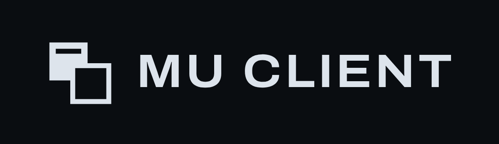
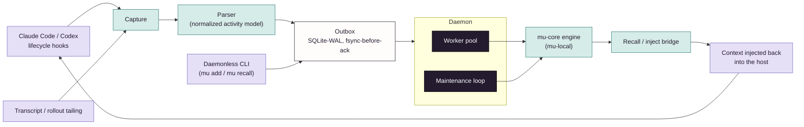

# mu-client

The local daemon and host integrations: capture, injection, and your local stores.

Part of [Memory Universe](https://github.com/MemoryUniverse).

**The on-device daemon that gives your coding agents persistent memory.** Captures what happens in
your Claude Code and Codex sessions, keeps it on your own machine by default, and hands relevant
context back to your agent without you asking for it.

> **Status: early, under active development.** The daemonless CLI, Claude Code hook capture, Codex
> capture (both channels), the durable outbox, the daemon, recall injection, and the MCP tool
> surface are built and used daily against real sessions. See [Built vs.
> designed](#built-vs-designed-read-this-before-you-evaluate-it). Live shared rooms and cross-vendor
> governed sharing are designed, not shipped, and depend on the not-yet-public `mu-server`. A
> private beta has **not started** — design partners are being recruited for one.

## The vision

Memory Universe is the persistent collaborative session and memory layer for teams of people *and*
their AI agents — across users, devices, agents, and vendors. Context survives the handoff between
sessions, teammates, machines and vendors, and travels only as far as it was authorized to.
`mu-client` is the piece of that vision that runs entirely on your machine: it is what actually
watches your agent sessions, decides what's worth remembering, and feeds it back, with nothing
leaving your device unless you explicitly share it.

## What's in this repo

`mu-client` is a Python daemon + CLI, depending only on `mu-core` (never on any server code):

- **Capture, two hosts**: hook-based auto-capture from Claude Code's hook fleet
  (`UserPromptSubmit`, `PostToolUse`, `SubagentStop`, `Stop`, `SessionStart`/`SessionEnd`,
  `PreCompact`), plus Codex on both of *its* real channels — a tailer over
  `~/.codex/sessions/**/rollout-*.jsonl` and a parser for the `agent-turn-complete` notify envelope
  (both verified empirically against codex-cli 0.146.0) — all mapped into one normalized activity
  model. Capture never blocks or fails your agent's turn; on any outage it spools to disk and always
  exits cleanly.
- **Durable outbox**: a real WAL-mode SQLite outbox (`synchronous=FULL`, fsync-before-ack,
  idempotent redelivery) sits between "the hook fired" and "the memory engine ingested it," so a
  daemon crash mid-flight never silently loses or duplicates an activity.
- **Injection**: recalled memory is rendered back into the host's context (`additionalContext` on
  `SessionStart`/`UserPromptSubmit`) with an explicit fresh/stale/cold staleness contract and a
  budget that degrades to a named file-spill rather than a silent truncation.
- **The local engine**: `mu-client` runs `mu-engine` (from `mu-core`) directly, so a laptop with no
  server anywhere is a complete memory system: capture, all three tiers, promotion/demotion,
  conflict handling, recall.
- **The `mu` CLI**: `add` / `recall` / `search` (daemonless, one-shot), `health`, `pin` / `unpin`,
  `capture-once` (the hook entrypoint), `backfill-thinking` / `backfill-codex`, `flush` (drain the
  spool/outbox with no daemon running), `daemon run` (the resident daemon, graceful shutdown on
  SIGINT/SIGTERM), and `install` / `uninstall` for `claude-code` and `codex` — the installers write
  their host config non-clobberingly.
- **An MCP server**: 14 tools over the same engine — `add`, `recall`, `get`, `consolidate`,
  `search`, `build_context`, `ask`, `promote`, `demote`, `update`, `delete`, `health`, `pin`,
  `unpin` — so any MCP-speaking host can drive the memory directly.

## Quickstart

`mu-client` is not on PyPI yet, and neither are the three `mu-core` distributions it runs on
(`mu-contracts`, `mu-engine`, `mu-local`). Until they are, there are exactly two install routes
that work, and both are stated here in full rather than implied.

**Route 1 — clone `mu-core` as a sibling, then `uv sync`.** This is the developer route: it binds
the engine to a working tree you can edit.

```bash
git clone -b dev/mlm-build https://github.com/MemoryUniverse/mu-core   # branch AND sibling — see below
git clone https://github.com/MemoryUniverse/mu-client
cd mu-client
uv sync --extra dev
```

The `mu-core` clone is **not optional and not a nicety.** `pyproject.toml` resolves
`mu-contracts` / `mu-engine` / `mu-local` through `[tool.uv.sources]` as `../mu-core/packages/...`,
relative to *this* file, so the two repos must sit side by side in the same parent directory. Clone
`mu-client` alone and `uv sync` stops with:

```
error: Failed to generate package metadata for `mu-contracts==0.1.0 @ editable+../mu-core/packages/mu-contracts`
  Caused by: Distribution not found at: file:///.../mu-core/packages/mu-contracts
```

(The `docker compose -f ../mu-core/...` line further down assumes the same layout.)

**`-b dev/mlm-build` is equally not optional**, and it fails far more quietly. GitHub's default
branch on `mu-core` is `main`, and `main` still carries the empty `mu_contracts.contracts`
scaffold. Clone `mu-core` without the branch and nothing complains — `uv sync --extra dev` exits
`0`, all 178 packages install — and then the very first command dies:

```
$ uv run mu --help
  File ".../src/mu_client/host.py", line 26, in <module>
    from mu_contracts.contracts.recall import RecallResult
ModuleNotFoundError: No module named 'mu_contracts.contracts.recall'
```

A clean install followed by an instant crash is worse than a resolver error, so it is stated here
rather than left to be discovered. `dev/mlm-build` is `mu-core`'s trunk; landing it on `main` is
the real fix and is the repository owner's call, not a documentation one.

**Route 2 — install straight from git, no clone, no registry.** This is the "just let me try it"
route. It needs `--no-sources`: the `[tool.uv.sources]` table above is a *development* override,
and uv otherwise honours it even over a git URL and tries to resolve `../mu-core/...` against the
git remote.

```bash
uv venv --python 3.12 && source .venv/bin/activate
uv pip install --no-sources \
  "mu-contracts @ git+https://github.com/MemoryUniverse/mu-core@dev/mlm-build#subdirectory=packages/mu-contracts" \
  "mu-engine    @ git+https://github.com/MemoryUniverse/mu-core@dev/mlm-build#subdirectory=packages/mu-engine" \
  "mu-local     @ git+https://github.com/MemoryUniverse/mu-core@dev/mlm-build#subdirectory=packages/mu-local" \
  "mu-client    @ git+https://github.com/MemoryUniverse/mu-client"
```

The three `mu-core` URLs carry `@dev/mlm-build` for the reason given above; `mu-client`'s own
default branch *is* its trunk, so it needs no ref. There is no lockfile pin that can substitute:
`[tool.uv.sources]` binds `mu-core` by filesystem path, so `uv.lock` records
`editable = "../mu-core/packages/mu-contracts"` and has no branch to hold — which branch is
checked out in that sibling directory is decided by the `git clone` above and by nothing else.

All four URLs are required: `mu-client`'s own metadata names `mu-contracts`/`mu-engine`/`mu-local`,
and with nothing published under those names a resolver has nowhere else to find them.

**One prerequisite, stated up front:** the engine binds real stores — a Redis/Valkey-compatible KV
floor for STM, Qdrant for MTM, FalkorDB for LTM. `mu-client` ships no compose file of its own, so
either point it at stores you already run (`MU_STORAGE__*` env vars, or
`~/.memory-universe/config.env`, which the installers write) or borrow `mu-core`'s dev stack:

```bash
docker compose -f ../mu-core/docker-compose.dev.yml up -d
```

Without them the first command below fails with a connection error rather than a helpful one — no
account or network call is involved, but the three containers are not optional.

Try it daemonless: no daemon, no socket, just the engine:

```bash
uv run mu add "We moved the staging DB migration window to Tuesdays 02:00 UTC."
uv run mu recall "when is the migration window?"
```

Run the resident daemon (needed for live hook capture + injection):

```bash
uv run mu daemon run
```

Wire it into Claude Code by pointing a hook at `scripts/hooks/mu_capture_once.sh`. See
`scripts/hooks/mu_capture_once.settings.example.json` for the exact managed block to merge into
`~/.claude/settings.json`. Every event runs through the same script into
`mu capture-once --host claude_code`; nothing is capture-and-guess, and an unrecognized hook shape
fails loud rather than silently mis-mapping.

Codex is wired the same way: `uv run mu install codex` writes the `notify` program and the
`[mcp_servers.memory-universe]` block into `~/.codex/config.toml` without clobbering what is already
there, and `mu backfill-codex` replays existing rollout files. Codex sessions can also use the
daemonless `mu add` / `mu recall` commands directly.

## Architecture, in one paragraph



A tiny shell shim (`scripts/hooks/mu_capture_once.sh`) is registered into the host's lifecycle
hooks; it resolves `mu`, pipes the event on stdin into `mu capture-once`, and always exits 0. From
there the event either takes a fast local IPC path to a running daemon or falls back to a direct,
fsync'd SQLite-WAL append. Capture is never gated on the daemon being up. The daemon itself is one Python process running an
`asyncio.TaskGroup` that owns the engine, the outbox worker pool, and a Unix-socket IPC server, with
ordered shutdown (stop inbound → drain outbox → release the engine, never the reverse). Captured
activity flows outbox → ingest → `mu-engine`'s STM/MTM/LTM tiers exactly as it would through
`mu-local` directly; recall runs the same federated read and is rendered back into the host's
context through the injector. No part of this requires an account, a server, or a network call.
Everything above is local-first by construction.

## Built vs. designed: read this before you evaluate it

- **Built and dogfooded today:** the daemonless CLI, Claude Code hook capture (full hook fleet),
  Codex capture on both channels plus its installer, the durable outbox, the resident daemon, recall
  injection, memory health, pin/unpin, the 14-tool MCP surface, and local small-model (SLM) wiring
  for extraction and synthesis — exercised against real, live Claude Code and Codex sessions, not
  synthetic fixtures.
- **In progress:** Claude Desktop support, and broadening the set of hosts beyond the two above.
- **Designed, not shipped, depends on `mu-server` (not yet public):** a member binding their own
  Claude Code or Codex instance into a *shared, multi-human room* as a governed first-class
  participant under its own identity, and any form of cross-device sync. None of that exists in this
  repo, and nothing here should be read as claiming it does.

## Where this fits

Part of **Memory Universe**: [github.com/MemoryUniverse](https://github.com/MemoryUniverse).

| Repo | Role |
|---|---|
| [`mu-core`](https://github.com/MemoryUniverse/mu-core) | The open engine `mu-client` runs on-device: contracts, engine, local facade, reference HTTP server |
| **mu-client** (this repo) | The on-device daemon: hook capture, injection, CLI |
| [`mu-sdk-python`](https://github.com/MemoryUniverse/mu-sdk-python) | Python developer SDK: typed wire client, plus an in-process embedded mode |
| [`mu-sdk-js`](https://github.com/MemoryUniverse/mu-sdk-js) | JavaScript/TypeScript developer SDK, wire-parity with the Python SDK |
| `mu-server` (private) | The hosted, governed, multi-tenant plane: the commercial part |

## License

Apache-2.0 (see `LICENSE`). Open-core: `mu-client`, `mu-core`, and both SDKs are fully open and stay
full-quality on their own. `mu-server`, the hosted plane needed once other tenants, other people's
data, and billing are involved, is the separate commercial product.

## Background

This is independent, early-stage work: the productization of roughly a year of the founder's
graduation-thesis research on multi-user agentic memory. There's no company and no customer logos to
show, just daily-driven code and an open build-in-public process.

## Contact

- GitHub: [@TRextabat](https://github.com/TRextabat)
- Email: amiramiritabat01@gmail.com

## Links

- Organization: [github.com/MemoryUniverse](https://github.com/MemoryUniverse)
- Issues / discussion: use this repo's GitHub Issues
- License: [Apache-2.0](./LICENSE)
