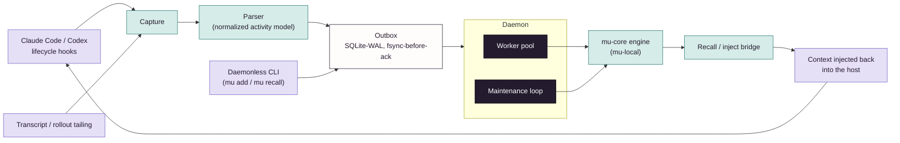

# mu-client

The local daemon and host integrations: capture, injection, and your local stores.

Part of [Memory Universe](https://github.com/MemoryUniverse).

**The on-device daemon that gives your coding agents persistent memory.** Captures what happens in
your Claude Code and Codex sessions, keeps it on your own machine by default, and hands relevant
context back to your agent without you asking for it.

> **Status: early, under active development (private beta in progress).** The daemonless CLI,
> Claude Code hook capture, the durable outbox, the daemon, and recall injection are built and used
> daily against real sessions. Codex support is landing next; see [Built vs.
> designed](#built-vs-designed-read-this-before-you-evaluate-it). Live shared rooms and
> cross-vendor governed sharing are designed, not shipped, and depend on the not-yet-public
> `mu-server`.

## The vision

Memory Universe is a persistent, governed context layer for teams of people *and* their AI agents.
Context survives the handoff across sessions, teammates, machines, and agent vendors, and
travels only as far as it was authorized to. `mu-client` is the piece of that vision that runs
entirely on your machine: it is what actually watches your agent sessions, decides what's worth
remembering, and feeds it back, with nothing leaving your device unless you explicitly share it.

## What's in this repo

`mu-client` is a Python daemon + CLI, depending only on `mu-core` (never on any server code):

- **Capture**: hook-based auto-capture from Claude Code's hook fleet (`UserPromptSubmit`,
  `PostToolUse`, `SubagentStop`, `Stop`, `SessionStart`/`SessionEnd`, `PreCompact`), mapped into a
  normalized activity model. Capture never blocks or fails your agent's turn; on any outage it
  spools to disk and always exits cleanly.
- **Durable outbox**: a real WAL-mode SQLite outbox (`synchronous=FULL`, fsync-before-ack,
  idempotent redelivery) sits between "the hook fired" and "the memory engine ingested it," so a
  daemon crash mid-flight never silently loses or duplicates an activity.
- **Injection**: recalled memory is rendered back into the host's context (`additionalContext` on
  `SessionStart`/`UserPromptSubmit`) with an explicit fresh/stale/cold staleness contract and a
  budget that degrades to a named file-spill rather than a silent truncation.
- **The local engine**: `mu-client` runs `mu-engine` (from `mu-core`) directly, so a laptop with no
  server anywhere is a complete memory system: capture, all three tiers, promotion/demotion,
  conflict handling, recall.
- **The `mu` CLI**: `add` / `recall` / `search` (daemonless, one-shot), `capture-once` (the hook
  entrypoint), `flush` (drain the spool/outbox with no daemon running), and `daemon run` (the
  resident daemon, graceful shutdown on SIGINT/SIGTERM).

## Quickstart

```bash
git clone https://github.com/MemoryUniverse/mu-client
cd mu-client
uv sync --extra dev
```

Try it daemonless: no daemon, no socket, just the engine:

```bash
uv run mu add "We moved the staging DB migration window to Tuesdays 02:00 UTC."
uv run mu recall "when is the migration window?"
```

Run the resident daemon (needed for live hook capture + injection):

```bash
uv run mu daemon run
```

Wire it into Claude Code by pointing a hook at `scripts/hooks/mu_capture_once.sh`. See
`scripts/hooks/mu_capture_once.settings.example.json` for the exact managed block to merge into
`~/.claude/settings.json`. Every event runs through the same script into
`mu capture-once --host claude_code`; nothing is capture-and-guess, and an unrecognized hook shape
fails loud rather than silently mis-mapping.

Codex support is being built the same way; today Codex sessions can use the daemonless `mu add`/
`mu recall` commands directly, with hook-based auto-capture for Codex as the next milestone.

## Architecture, in one paragraph



A tiny Go hook-client is registered into the host's lifecycle hooks; on every event it either hits
a fast local IPC path to a running daemon or falls back to a direct, fsync'd SQLite-WAL append.
Capture is never gated on the daemon being up. The daemon itself is one Python process running an
`asyncio.TaskGroup` that owns the engine, the outbox worker pool, and a Unix-socket IPC server, with
ordered shutdown (stop inbound → drain outbox → release the engine, never the reverse). Captured
activity flows outbox → ingest → `mu-engine`'s STM/MTM/LTM tiers exactly as it would through
`mu-local` directly; recall runs the same federated read and is rendered back into the host's
context through the injector. No part of this requires an account, a server, or a network call.
Everything above is local-first by construction.

## Built vs. designed: read this before you evaluate it

- **Built and dogfooded today:** the daemonless CLI, Claude Code hook capture (full hook fleet), the
  durable outbox, the resident daemon, recall injection, and local small-model (SLM) wiring for
  extraction and synthesis, exercised against real, live Claude Code sessions, not synthetic
  fixtures.
- **In progress:** Codex hook-based auto-capture (Codex sessions work today via the CLI; native hook
  wiring is the near-term next step), and Claude Desktop support.
- **Designed, not shipped, depends on `mu-server` (not yet public):** a member binding their own
  Claude Code or Codex instance into a *shared, multi-human room* as a governed first-class
  participant under its own identity, and any form of cross-device sync. None of that exists in this
  repo, and nothing here should be read as claiming it does.

## Where this fits

Part of **Memory Universe**: [github.com/MemoryUniverse](https://github.com/MemoryUniverse).

| Repo | Role |
|---|---|
| [`mu-core`](https://github.com/MemoryUniverse/mu-core) | The open engine `mu-client` runs on-device: contracts, engine, local facade |
| **mu-client** (this repo) | The on-device daemon: hook capture, injection, CLI |
| [`mu-sdk-python`](https://github.com/MemoryUniverse/mu-sdk-python) | Python developer SDK: for building your own tools on Memory Universe |
| [`mu-sdk-js`](https://github.com/MemoryUniverse/mu-sdk-js) | JavaScript/TypeScript developer SDK, parity with the Python SDK |
| `mu-server` (private) | The hosted, governed, multi-tenant plane: the commercial part |

## License

Apache-2.0 (see `LICENSE`). Open-core: `mu-client`, `mu-core`, and both SDKs are fully open and stay
full-quality on their own. `mu-server`, the hosted plane needed once other tenants, other people's
data, and billing are involved, is the separate commercial product.

## Background

This is independent, early-stage work: the productization of roughly a year of the founder's
graduation-thesis research on multi-user agentic memory. There's no company and no customer logos to
show, just daily-driven code and an open build-in-public process.

## Contact

- GitHub: [@TRextabat](https://github.com/TRextabat)
- Email: amiramiritabat01@gmail.com

## Links

- Organization: [github.com/MemoryUniverse](https://github.com/MemoryUniverse)
- Issues / discussion: use this repo's GitHub Issues
- License: [Apache-2.0](./LICENSE)
